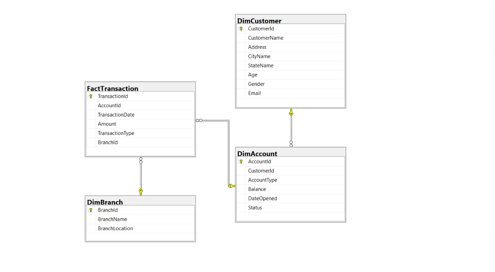
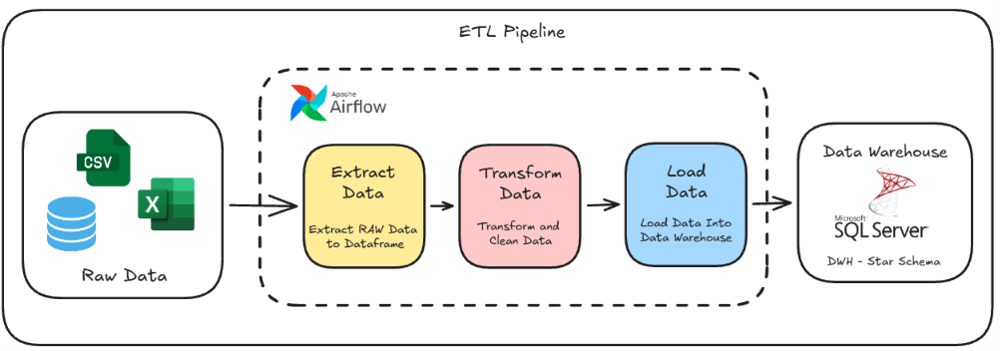

# 🏦 [Final Task] Designing Data Warehouse & Implementing Stored Procedures

Final task submission for the Data Engineer Project Based Virtual Internship (PBI) at Rakamin Academy in collaboration with ID/X Partners.

## 📌 Project Overview

This project is part of the Data Engineer Project Based Virtual Internship (PBI) at Rakamin Academy, in collaboration with ID/X Partners. The main objective is to build a strong analytical data foundation through a data warehouse that supports the company's reporting and analytical needs.

The project addresses the difficulty of extracting data from multiple sources, such as Excel files, CSV files, and databases, at the same time. This difficulty causes reporting and data analysis activities to be delayed. The solution is an ETL pipeline that consolidates transaction data from these sources and combines it with master data from a source Microsoft SQL Server database.

The processed data is loaded into a target SQL Server data warehouse using a dimensional model. The transaction fact table is also sent to Google BigQuery for analytical use.

### ⭐ Data Warehouse Schema

The warehouse follows a simple star schema:



#### 📐 Dimension Tables

- 👤 `DimCustomer`: customer identity, address, city, state, age, gender, and email.
- 💳 `DimAccount`: account, customer, account type, balance, opening date, and status.
- 🏢 `DimBranch`: branch name and branch location.

#### 📊 Fact Table

- 💸 `FactTransaction`: transaction ID, account ID, transaction date, amount, transaction type, and branch ID.

The transformation layer standardizes column names, converts transaction dates, capitalizes selected text fields, and removes duplicate records based on each table's business key.

### 🔄 ETL Pipeline



1. 📥 **Extract**: Read transaction data from MSSQL, CSV, and XLSX sources. Read customer, city, state, account, and branch master data from MSSQL.
2. ⚙️ **Transform**: Build the customer, account, and branch dimensions. Concatenate transaction data from all three sources and create the transaction fact table.
3. 📤 **Load**: Append the dimensions and fact table to the target MSSQL data warehouse.
4. ☁️ **Publish**: Load `FactTransaction` from the target warehouse into the configured Google BigQuery table.

The pipeline is orchestrated entirely through Apache Airflow and is separated into two DAGs that should be triggered in sequence:

- 🧱 `etl_dimensional_table`: Loads `DimCustomer`, `DimAccount`, and `DimBranch`.
- 📈 `etl_fact_table`: Loads `FactTransaction` and then publishes it to BigQuery.

Two SQL Server stored procedures are also included for analytical queries:

- 💰 `BalancePerCustomer`: Calculates the current balance for active accounts matching a customer name.
- 📅 `DailyTransaction`: Aggregates transaction count and total amount by date within a requested date range.

## 🧰 Tech Stack

- 🐍 Python
- 🐼 Pandas
- 🔌 SQLAlchemy and `pyodbc`
- 🗄️ Microsoft SQL Server
- 🌬️ Apache Airflow 3.3.0
- 🐳 Docker and Docker Compose
- 🐘 PostgreSQL for Airflow metadata
- ☁️ Google BigQuery
- 📄 `openpyxl` for XLSX extraction

## 🗂️ Project Directory Structure

```text
.
├── airflow/
│   └── dags/
│       ├── dim_dag.py              # Dimension ETL DAG
│       └── fact_dag.py             # Fact ETL and BigQuery DAG
├── data/
│   └── raw/
│       ├── sample.bak              # Database source
│       ├── transaction_csv.csv     # CSV transaction source
│       └── transaction_excel.xlsx  # XLSX transaction source
├── docker/
│   ├── Dockerfile                  # Custom Airflow image
│   └── docker-compose.yaml         # Airflow and PostgreSQL services
├── sql/
│   ├── sp_BalancePerCustomer.sql   # Customer balance procedure
│   └── sp_DailyTransaction.sql     # Daily transaction procedure
├── src/
│   ├── config/connection.py        # Database connection factory
│   ├── extracts/                   # CSV, XLSX, and MSSQL extractors
│   ├── load/load.py                # MSSQL loading function
│   └── transform/transform.py      # Dimension and fact transformations
└── .env                            # Local configuration, not committed
```

## 🚀 How To Run The Project

### ✅ Prerequisites

- 🐳 Docker Desktop with Docker Compose
- 🔐 Access to the source and target Microsoft SQL Server databases
- ☁️ A Google Cloud project and service account with permission to write to BigQuery
- 📁 The required raw input files, including `transaction_csv.csv` and `transaction_excel.xlsx`, in `data/raw/`

### ⚙️ Configuration

Create a `.env` file in the project root. The application expects the following variables:

```env
DB_SERVER=<sql-server-host>
DB_USER=<sql-server-user>
DB_PASS=<sql-server-password>
SOURCE_DB=<source-database-name>
TARGET_DB=<target-database-name>
FERNET_KEY=<airflow-fernet-key>
BQ_TABLE_ID=<bigquery-dataset.table>
AIRFLOW_UID=50000
```

Configure the Google Cloud service account through the Airflow `gcp_default` connection and make sure the service account JSON file is available to the environment. Do not commit database passwords, private keys, or other credentials.

### ▶️ Run With Docker Compose

From the project root, build the custom Airflow image and start the services:

```bash
docker compose -f docker/docker-compose.yaml up --build
```

Open the Airflow web interface at `http://localhost:8080`. The default local Airflow credentials are `airflow` / `airflow` unless overridden through `_AIRFLOW_WWW_USER_USERNAME` and `_AIRFLOW_WWW_USER_PASSWORD` in the environment.

Trigger the `etl_dimensional_table` DAG first, then trigger `etl_fact_table`. Both DAGs are configured with no schedule, so they must be triggered manually.

To stop the services:

```bash
docker compose -f docker/docker-compose.yaml down
```

## 🙏 Acknowledgments

Thank you to Rakamin Academy and ID/X Partners for providing the Project Based Virtual Internship and the data engineering case study.
